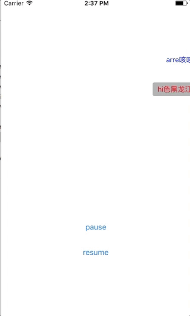

用swift3.1编写的弹幕组件，支持iOS8.0，效果如下。



#### 用法

设置好数据源即可。

```
class ViewController: UIViewController {
	
    lazy var danmuView: SLDanmuView = {
        var danmuView = SLDanmuView(frame: CGRect(x: 0, y: 50, width: self.view.width, height: 150))
        return danmuView
    }()
    
    override func viewDidLoad() {
        super.viewDidLoad()
        // Do any additional setup after loading the view, typically from a nib.
        
        var list = [SLDanmuInfo]()
        
        //test
        var info = SLDanmuInfo(text: "hi色黑龙江凡士林", textColor: UIColor.red, itemViewClass: SLDanmuBgItemView.self)
        list.append(info)
        
        info = SLDanmuInfo(text: "arre咳咳咳看", textColor: UIColor.blue, itemViewClass: SLDanmuItemView.self)
        list.append(info)
        
        info = SLDanmuInfo(text: "fds分手快乐发送", textColor: UIColor.black, itemViewClass: SLDanmuBgItemView.self)
        list.append(info)
        
        info = SLDanmuInfo(text: "23诶偶无偶", textColor: UIColor.purple, itemViewClass: SLDanmuItemView.self)
        list.append(info)
        
        for i in 0...10 {
            info = SLDanmuInfo(text: "考四六级" + String(i), textColor: UIColor.red, itemViewClass: SLDanmuItemView.self)
            list.append(info)
        }
        
        danmuView.pendingList.append(contentsOf: list)
	
        self.view.addSubview(danmuView)
    }
```


#### 弹幕数据结构


结构定义如下：
	
```
class SLDanmuInfo {
    var text: String
    var textColor: UIColor = UIColor.black
    var itemViewClass: AnyClass = SLDanmuItemView.self
    ...
}
	
```
	
更新ui，sizeToFit更新frame。
	
```
	
class SLDanmuItemView: UIView {
	func updateDanmuInfo(info: SLDanmuInfo) {
        label.text = info.text
        label.textColor = info.textColor
        
        setNeedsLayout()
    }

  // 计算自身frame
  override func sizeToFit() {
        super.sizeToFit()
        
        label.sizeToFit()
        
        label.frame = CGRect(x: leftMargin, y: topMargin, width: label.frame.size.width, height: label.frame.size.height)
        
        self.frame = CGRect(x: self.frame.origin.x, y: self.frame.origin.y, width: label.frame.size.width + 2 * leftMargin, height: label.frame.size.height + 2 * topMargin)
    }
}
	
```
	
这种是最基础的，只更新text。由于要支持不同样式的弹幕，所以定义了`itemViewClass`。可设置该条弹幕所展示ui的`class`。

#### 自定义弹幕ui
	
同时也可以自定义弹幕ui继承自`SLDanmuItemView`，danmuInfo继承`SLDanmuInfo`，在自定义ui中更新danmuInfo，`注意要重写sizeToFit，设置好frame`。

	
```
class SLDanmuBgItemView: SLDanmuItemView {
	lazy var bgView: UIView = {
	        var bgView = UIView()
	        
	        bgView.backgroundColor = UIColor.lightGray
	        bgView.layer.cornerRadius = 4
	        bgView.clipsToBounds = true
	        
	        return bgView
	    }()
	
	    override func commonInit() {
	        super.commonInit()
	        self.insertSubview(bgView, belowSubview: label)
	    }

	override func updateDanmuInfo(info: SLDanmuInfo) {
	        super.updateDanmuInfo(info: info)
	    
	        if let info = info as? SLBgDanmuInfo {
	            bgView.backgroundColor = info.bgColor
	        }
	    }

    override func sizeToFit() {
        super.sizeToFit()
        bgView.frame = self.bounds
    }
}
```
	
```
class SLBgDanmuInfo: SLDanmuInfo {
    var bgColor: UIColor
    ...
}
```

同时也可以自定义弹幕ui继承自`SLDanmuItemView`，danmuInfo继承`SLDanmuInfo`，在自定义ui中更新danmuInfo。
	
```
class SLDanmuBgItemView: SLDanmuItemView {
	override func updateDanmuInfo(info: SLDanmuInfo) {
	        super.updateDanmuInfo(info: info)
	    
	        if let info = info as? SLBgDanmuInfo {
	            bgView.backgroundColor = info.bgColor
	        }
	    }
}
```
	
```
class SLBgDanmuInfo: SLDanmuInfo {
    var bgColor: UIColor
    ...
}
```

具体分析见文章：[iOS弹幕之swift实现
](http://www.jianshu.com/p/5438356cd4ec)


